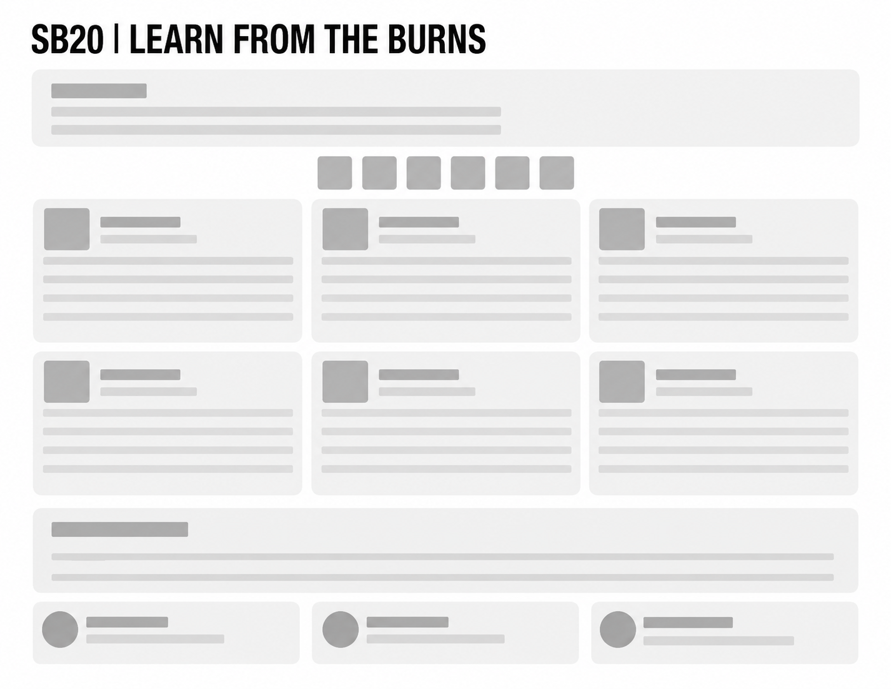

Failure is not the end of growth. Ignoring failure is.

Most men either avoid failure, hide from it, or let it define them. That keeps the same problems repeating year after year. This worksheet is designed to stop that cycle. You are going to study failure directly, extract the lesson, and turn it into a stronger system.

This process only works if you answer honestly. Do not write what sounds smart. Write what is true. A weak answer protects your ego. A truthful answer changes your life.

The goal is not to feel better about failure. The goal is to become harder to stop the next time pressure hits.

---

## R = REVIEW THE FAILURE

Before you can improve anything, you must see it clearly. Most men skip this step because they rush into excuses, blame, or emotional reactions. That keeps the lesson hidden.

In this section, you will break down exactly what happened.

### Fill Out:

- What happened?
- What was the goal?
- What was the outcome?
- What actions led to the failure?
- What facts cannot be denied?

### What Works:

- Specific details
- Clear timelines
- Honest ownership
- Real actions and outcomes

### Avoid:

- “Everything went wrong”
- Blaming other people only
- Emotional exaggeration
- Vague answers with no details

### Example:

Weak answer:

- “My boss screwed me over.”

Strong answer:

- “I missed two deadlines, avoided communication, and turned work in late. My boss lost trust because I stayed silent instead of asking for help earlier.”

You are not here to protect your pride. You are here to expose reality.

---

## E = EXPOSE THE WEAKNESS

Failure usually points to one weak area. Lack of discipline. Fear. Poor preparation. Avoidance. Laziness. Disorganization. Emotional reactions.

This section is where you identify the real crack in the system.

### Fill Out:

- What weakness showed up?
- What habit or pattern caused the problem?
- What pressure exposed this weakness?
- Where have you seen this pattern before?

### What Works:

- Naming one clear weakness
- Identifying repeated patterns
- Connecting actions to consequences

### Avoid:

- Listing ten different weaknesses
- Hiding behind “bad luck”
- Pretending you had no control

### Example:

Weak answer:

- “I just had a rough week.”

Strong answer:

- “I avoid difficult tasks until pressure becomes panic. Then I rush and make mistakes.”

Pressure does not create weakness. It reveals it.

---

## F = FIND THE LESSON

Failure becomes valuable when it teaches you something useful. Most people repeat failure because they only feel pain from it instead of studying it.

This section turns pain into information.

### Fill Out:

- What lesson is this failure trying to teach you?
- What should you have done differently?
- What skill or behavior is missing?
- What warning signs did you ignore?

### What Works:

- Practical lessons
- Clear behavior changes
- Lessons tied to action

### Avoid:

- Empty motivation quotes
- “Just work harder”
- Generic answers with no direction

### Example:

Weak answer:

- “Never give up.”

Strong answer:

- “I need to prepare before pressure arrives instead of reacting after problems already started.”

The lesson is only useful if it changes future behavior.

---

## I = INSTALL A BETTER SYSTEM

Motivation fades. Systems repeat.

This section is where you build a structure that prevents the same failure from happening again.

### Fill Out:

- What new system will you install?
- What daily or weekly habit will support it?
- What needs to be removed?
- What support or structure do you need?

### What Works:

- Small repeatable systems
- Scheduled habits
- Clear accountability
- Simple measurable actions

### Avoid:

- Massive unrealistic plans
- Depending on motivation
- “I’ll just try harder”

### Example:

Weak answer:

- “I’ll be more disciplined.”

Strong answer:

- “I will spend 20 minutes planning tomorrow before bed every night and review deadlines every morning.”

Systems reduce chaos before pressure arrives.

---

## N = NAVIGATE THE NEXT ATTEMPT

A lesson means nothing if you never step back into the arena. Growth only happens when you apply the adjustment under pressure again.

This section prepares you to re-enter the challenge.

### Fill Out:

- What action will you attempt next?
- When will you take that action?
- What fear still exists?
- How will you respond differently this time?

### What Works:

- Immediate action steps
- Specific dates or situations
- Honest fear assessment
- Clear behavioral adjustments

### Avoid:

- Waiting for confidence
- Endless preparation
- Avoiding risk completely

### Example:

Weak answer:

- “I’ll try again eventually.”

Strong answer:

- “I will apply for the promotion next month after finishing my certification course and practicing interviews weekly.”

Confidence is built after action, not before it.

---

## E = EVOLVE THROUGH REPETITION

One lesson will not transform your life. Repeated correction will.

This final section helps you understand that growth is not one breakthrough moment. It is repeated refinement under pressure.

### Fill Out:

- What pattern must permanently change?
- What behavior will you repeat consistently?
- What identity are you building through this process?
- What will happen if nothing changes?

### What Works:

- Long-term thinking
- Identity-based answers
- Consistent habits tied to character

### Avoid:

- Temporary emotional promises
- Depending on inspiration
- Thinking one success fixes everything

### Example:

Weak answer:

- “I just need one good month.”

Strong answer:

- “I am building the identity of a man who studies mistakes quickly and adjusts without quitting.”

Your future is built from repeated patterns, not isolated moments.

---

## FINAL REFLECTION

Answer these honestly before finishing:

- What failure still controls your thinking?
- What truth did you avoid before this exercise?
- Which step was hardest to complete and why?
- What system now needs to change immediately?
- What will your life look like in one year if you repeat this process consistently?

---

## FINAL STRIKE

Failure already cost you something.

Time. Confidence. Momentum. Respect. Opportunity.

The question is whether it becomes wasted pain or useful pressure.

Most men fail, feel embarrassed, then repeat the same behavior again later.

You now have a process to stop that cycle.

Use it or stay the same.
