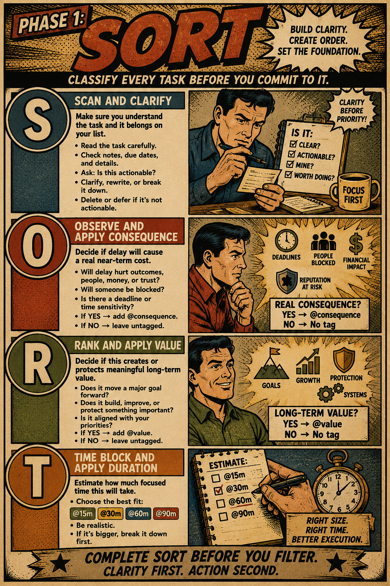
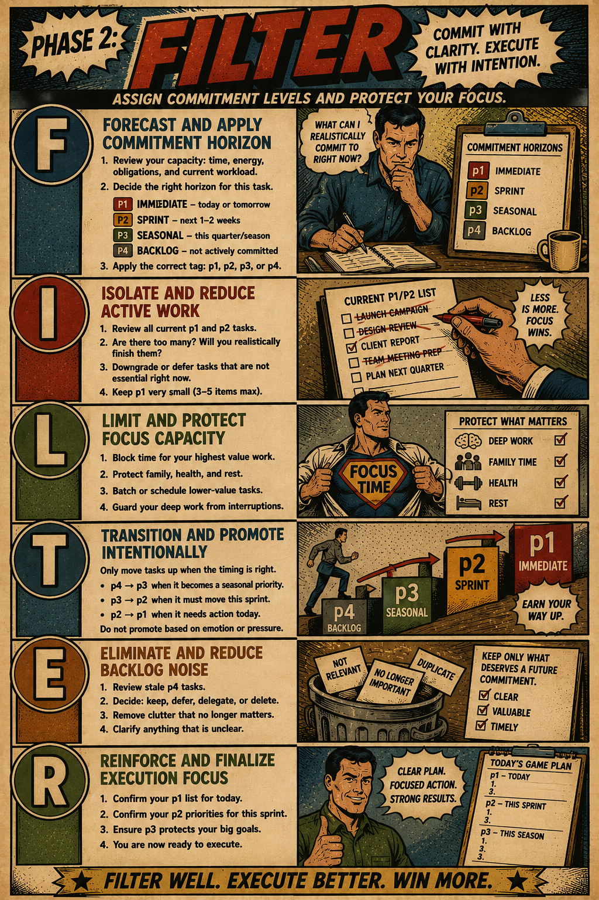
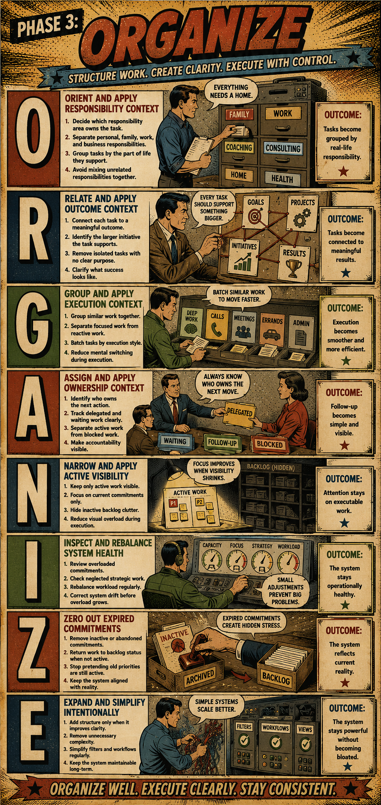

For years, I treated productivity systems the way some people treat diets. I’d commit hard, evangelize them to friends, buy the notebooks, rebuild my workflows, then quietly abandon the whole thing six weeks later when reality returned.

I went through the canonical sequence.
Getting Things Done.
Bullet Journaling.
PARA.
Time blocking.
Kanban boards.
Second brains.
Daily themes.
Weekly sprints.

Every system worked beautifully in theory. Most worked for a while in practice. Then life would swell past the edges of the framework.

A sick kid. A surprise client escalation. Property issues. Family obligations. A week where every email arrived carrying consequence. Suddenly the elegant system became another source of guilt. The backlog thickened. The reviews got heavier. I stopped trusting the lists because the lists no longer reflected reality.

That was the real problem.

Most productivity systems are excellent at collecting commitments. Fewer are good at helping you distinguish between:

- what matters,
- what hurts if ignored,
- what you actually have capacity for,
- and what deserves your attention right now.

Those are different questions. I used to treat them like the same one.

The shift came when I stopped asking, “What’s important?” and started asking a more operational question:

> What kind of commitment does this actually deserve?

That led me to a system I’ve used consistently longer than anything else before it. It borrows heavily from the Eisenhower Matrix, but adds something I never found in most frameworks: execution horizons.

I call it the **Unified Horizon System**. The name sounds more corporate than I intended, but the idea is simple. Every task moves through three phases:

1. **Sort** — determine consequence, value, and execution weight
2. **Filter** — commit work into realistic horizons
3. **Organize** — structure work around actual life responsibilities

The system matters less than what it solved for me.

It separated emotional urgency from operational reality.

## The Moment I Realized My Backlog Was Lying To Me

Most task systems flatten work into a single dimension.

Everything sits beside everything else.

“Renew insurance” sits next to “Launch strategic initiative.”

“Call the plumber” sits next to “Improve marriage.”

“Fix payroll issue” sits next to “Get healthier.”

The software treats them equally because software loves lists. Human brains don’t.

What overwhelmed me wasn’t volume. It was ambiguity.

Some tasks carried consequence if delayed. Others carried long-term value. Some were merely ideas masquerading as commitments. Some required ninety focused minutes I did not have. Others were fifteen-minute tasks I kept postponing for months because they looked deceptively small.

I needed a system that answered four questions immediately:

- Will delay create pain?
- Does this create meaningful value?
- Have I actually committed to doing this?
- How much focused energy will it require?

Most systems answered maybe one of those.

## Phase 1: Sort

This is where nearly all backlog anxiety actually lives.

Not in execution. In unresolved decisions.

When I do a daily inbox scrub, a weekly review, or a quarterly reset, every task gets processed through four filters.

### S — Scan and Clarify

Before priorities, I clean language.

Vague tasks are dangerous because vague tasks resist action.

“Figure out finances” is not a task.
“Review Q2 business cash flow” is a task.

So I review:

- titles,
- notes,
- ownership,
- deadlines,
- dependencies,
- related goals.

Anything unclear gets rewritten. Anything non-actionable gets deleted or archived.

This sounds trivial until you realize how much mental friction comes from rereading the same ambiguous task for three weeks.

### O — Observe Consequence

This came directly from my frustration with false urgency.

I ask one question:

> Will delay create a real near-term cost?

If yes, the task gets tagged `@consequence`.

Not emotionally important. Consequential.

There’s a difference.

Real consequence usually looks like:

- blocked people,
- operational disruption,
- financial impact,
- damaged trust,
- family stress,
- missed deadlines.

This distinction changed how I plan my days. Some work screams loudly while contributing almost nothing long term. Other work quietly compounds value while never demanding attention.

Without separating those two categories, consequence-heavy work colonizes your life.

### R — Rank Value

Then I ask the opposite question:

> Does this create or protect meaningful long-term value?

If yes, it gets tagged `@value`.

That includes things like:

- strategic planning,
- health,
- family stability,
- leadership,
- systems work,
- business development.

One of the hardest lessons I learned is that high-value work is often non-urgent for dangerously long periods of time.

You can neglect strategic thinking for months before consequences arrive. By then, the damage is already operational.

### T — Time Block Duration

This may be the least glamorous part of the system and the most important.

Every task gets a realistic duration estimate:

- `@15m`
- `@30m`
- `@60m`
- `@90m`

Not aspirational estimates. Real ones.

Productivity systems often fail because they ignore execution weight. Ten one-hour tasks do not fit into a day simply because the calendar says you technically have ten hours available.

Human focus has overhead. Context switching has overhead. Family life has overhead.

I used to overload days constantly because my task manager treated all tasks as equal-sized rectangles. They are not.

## Phase 2: Filter

This is where the system stopped becoming a storage unit and started becoming trustworthy.

Most people don’t have a prioritization problem. They have a commitment inflation problem.

Everything becomes active at once.

So I created horizon buckets.

- `P1` — immediate execution
- `P2` — current sprint
- `P3` — seasonal commitment
- `P4` — inactive backlog

That last category changed everything.

### P4 Saved My System

Most productivity systems quietly encourage overcommitment because every task remains visually active forever.

But an idea is not a commitment.

Neither is an aspiration.

Neither is “someday.”

So now everything begins in `P4`.

That means:

> This exists. I acknowledge it. I am not currently committed to executing it.

That single distinction dramatically reduced the guilt embedded in my task lists.

A task can carry enormous value and still remain inactive.

That sounds obvious. It did not feel obvious when I was drowning in hundreds of “important” tasks.

### Why P1 Must Stay Tiny

I became suspicious of systems where daily lists routinely contained twenty-five items.

That’s not prioritization. That’s inventory.

My `P1` bucket is intentionally brutal. Immediate execution only. Usually today or tomorrow.

If too much enters `P1`, the system starts lying again.

The important psychological shift is this:

`P-levels` do not describe importance. They describe commitment horizons.

That distinction matters because high-value work can stay in `P3` for months while operational fires move temporarily into `P1`.

Without horizons, every decision becomes emotional and reactive.

## Phase 3: Organize

This phase matters because life is not a single project.

I’m not just managing work. I’m managing overlapping responsibilities:

- business,
- family,
- coaching,
- finances,
- health,
- property,
- relationships,
- planning.

Most systems collapse these domains into one giant stream. That works until one category consumes all visible attention.

So I organize tasks by:

- responsibility area,
- desired outcome,
- execution context,
- ownership,
- active visibility.

The key principle is visibility control.

I do not need to see inactive backlog clutter while trying to execute focused work.

That’s how task systems become psychological wallpaper.

## The Real Lesson Wasn’t About Productivity

The deeper confession here is that I spent years trying to optimize effort when I really needed to manage commitments.

Those are not the same thing.

I thought productivity meant finding the perfect method. The perfect app. The perfect review cadence. The perfect notebook layout.

What I actually needed was operational honesty.

To admit:

- I cannot actively prioritize everything.
- Valuable work is often quiet.
- Consequential work is often loud.
- Capacity matters more than ambition.
- A trustworthy system must reflect reality, not aspiration.

That last point changed my relationship with planning entirely.

Now when I review my system, I’m not asking:

> What would the ideal version of me commit to?

I’m asking:

> What can this actual week realistically support?

That question lowered my stress more than any productivity hack ever did.

## The Weekly Reset That Keeps Everything Functional

The system survives because the maintenance is lightweight.

Every morning:

1. Process inbox tasks
2. Apply consequence and value
3. Estimate duration
4. Assign commitment horizons
5. Review active `P1`

Every week:

1. Reassess `P2` and `P3`
2. Downgrade stale commitments
3. Remove clutter
4. Protect strategic work
5. Reduce active load

Every quarter, I do a broader seasonal review. That’s usually where I notice drift:

- too much reactive work,
- neglected long-term priorities,
- bloated active horizons,
- commitments that quietly expired months ago.

The system only works if reality is allowed to update the structure.

Otherwise you end up managing historical intentions instead of current commitments.

## What Finally Changed

I still miss deadlines sometimes. I still overload weeks occasionally. I still underestimate effort more often than I’d like.

But I no longer feel buried under an undifferentiated pile of obligations.

That feeling used to follow me everywhere.

Now I usually know:

- what carries consequence,
- what creates value,
- what I’ve actually committed to,
- and what can wait without guilt.

That last part matters more than I expected.

Because the real luxury isn’t getting everything done.

It’s trusting that what you’re _not_ doing has been intentionally decided.
