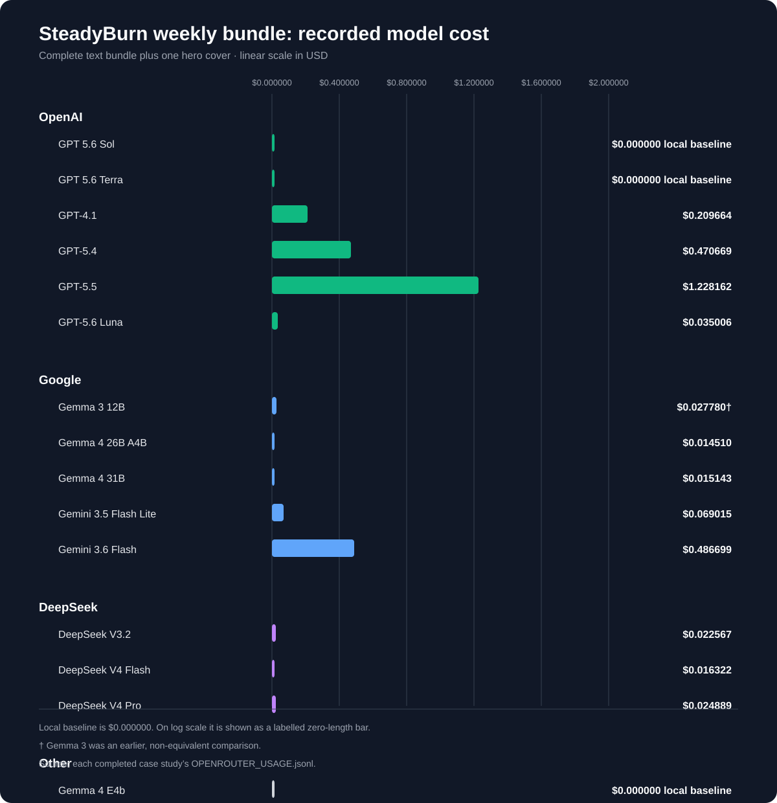
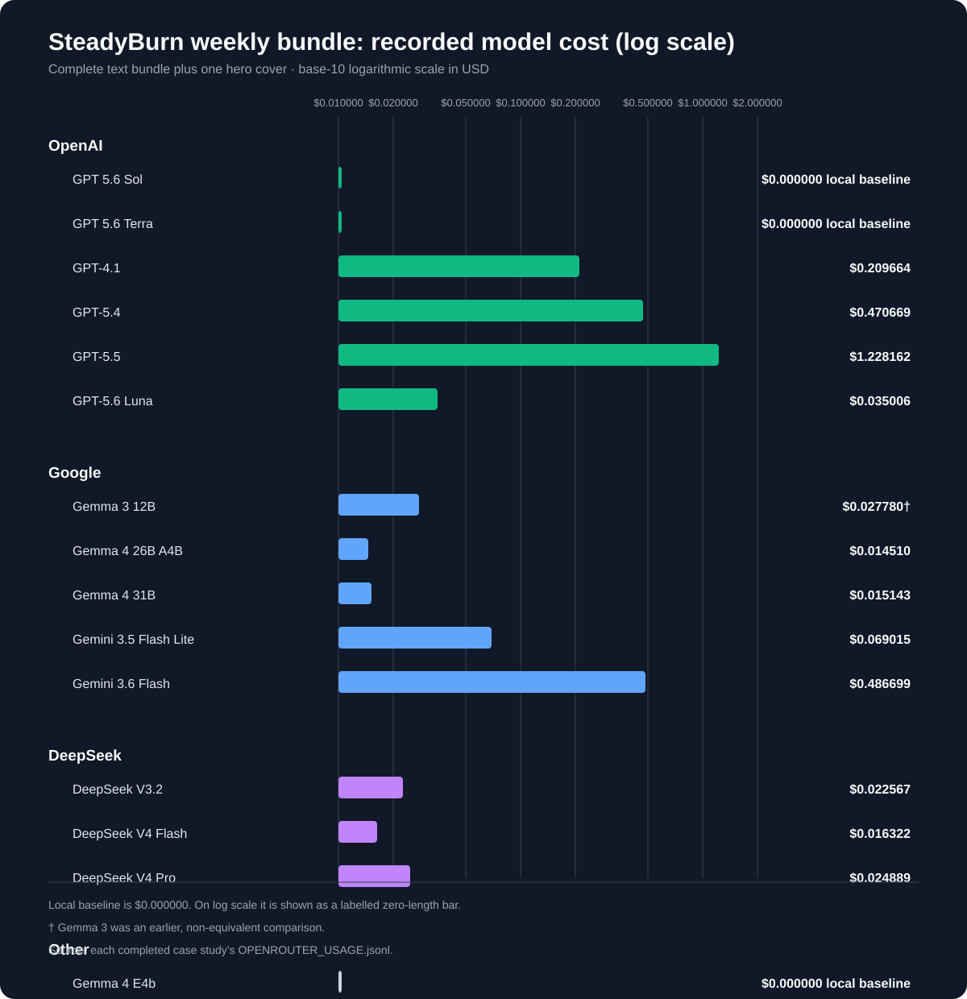
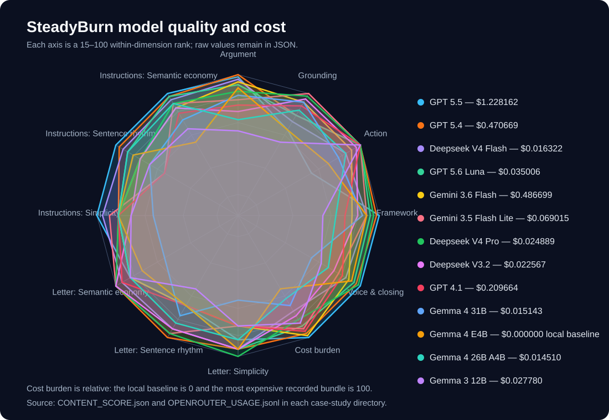

# SteadyBurn Weekly Bundle Model Comparisons

These case studies measure the practical cost of producing one complete SteadyBurn weekly content bundle with models that were active and available at the time of each run.

The local-model run is the baseline. It represents the capability already available on this machine: local text generation through llama-swap and a local hero-image model. The OpenRouter runs use the same seed, pipeline structure, and optional-track settings so their outputs and provider-reported costs can be compared against that baseline.

Each model directory contains one isolated run of the weekly bundle: context, lesson, instructions, worksheet copy, worksheet and masked worksheet, long-form letter, newsletter email, community post, cover prompt, rendered hero image, and the pipeline configuration used. OpenRouter case studies also include `OPENROUTER_USAGE.jsonl` and `MODEL_COMPARISON.md` with the provider-reported usage and cost.

These are comparison artifacts, not publishable site content. They live under `docs/model-comparisons` so evaluating model quality and operating cost does not change the live `content` collection or the executable automation package.

## Cost Charts

- [Linear scale](weekly-bundle-costs.svg): preserves absolute cost differences.
- [Logarithmic scale](weekly-bundle-costs-log.svg): makes the lower-cost models easier to compare.

## Readability measurements

analyze_readability.py provides apples-to-apples readability measurements for
every LESSON.md, index.md, and INSTRUCTIONS.md bundle in this directory. It
removes Markdown presentation syntax and applies one deterministic English
syllable heuristic to all model output.

From the repository root, run:

~~~
cd docs/model-comparisons
uv run python analyze_readability.py
~~~

The generated [readability report](readability-report.md) has bundle and
per-document tables. The matching JSON file preserves all raw measurements for
further comparison or charting.

## Refresh after a new case study

After adding a completed case study to a PR, run the generators from this directory before opening
or updating that PR:

~~~
cd docs/model-comparisons
uv run python analyze_readability.py
uv run python generate_cost_charts.py
uv run python generate_model_comparison.py
~~~

The chart generator uses each OpenRouter usage log and adds the local baseline
at `$0.000000`. It writes [cost-chart-data.json](cost-chart-data.json) plus the
linear and logarithmic cost SVGs. The log chart labels the zero-cost local bar
instead of attempting to plot zero on a logarithmic scale.

## Standard model comparison

`generate_model_comparison.py` compiles the standard editorial suite,
every metric from `readability-report.json`, and recorded bundle cost into
[model-comparison.json](model-comparison.json) and an interactive
[radar-chart dashboard](model-comparison.html). Raw readability values are
preserved for `LESSON.md`, `index.md`, `INSTRUCTIONS.md`, and the bundle total.

The dashboard has three radar views:

- Every individual LLM rubric standard from both primary artifacts.
- Every bundle-total readability metric from the readability report.
- A grouped overview for quick comparison.

Readability is min–max normalized only inside the radar so metrics with
different units can share a chart; the JSON remains the source of truth for raw
values. Cost is shown as **cost burden**: the local model is exactly `0`, and
the most expensive recorded bundle is exactly `100`.

Runs without `CONTENT_SCORE.json` remain visibly marked as awaiting LLM quality
scoring and are never assigned inferred editorial values. They still appear in
the readability-and-cost radar view.

The embedded snapshot is the grouped overview. Use the interactive
[radar-chart dashboard](model-comparison.html) to select models, switch between
the full metric views, and inspect the complete table and source measurements.

## Content scoring

The root uv command content-score evaluates index.md and INSTRUCTIONS.md using
the versioned SteadyBurn rubric. It combines deterministic measurements with
structured OpenRouter evidence extraction, repeated adjudication, and an
independent uncertainty tie-breaker. Evidence extraction uses DeepSeek V4 Flash;
all adjudication and tie-break calls use DeepSeek V4 Pro.

~~~
uv run content-score --case-study docs/model-comparisons/MODEL/RUN --max-cost 5
~~~

Scores are measurements, not qualification gates. Required-criterion misses
remain visible as score penalties, and FK Grade is reported beside each
artifact with Grade 6 as a reference target only. The scorer writes
CONTENT_SCORE.json and CONTENT_SCORE.md beside the case study, emits ignored
JSONL telemetry, and reuses ignored cache entries for unchanged artifact hashes.
